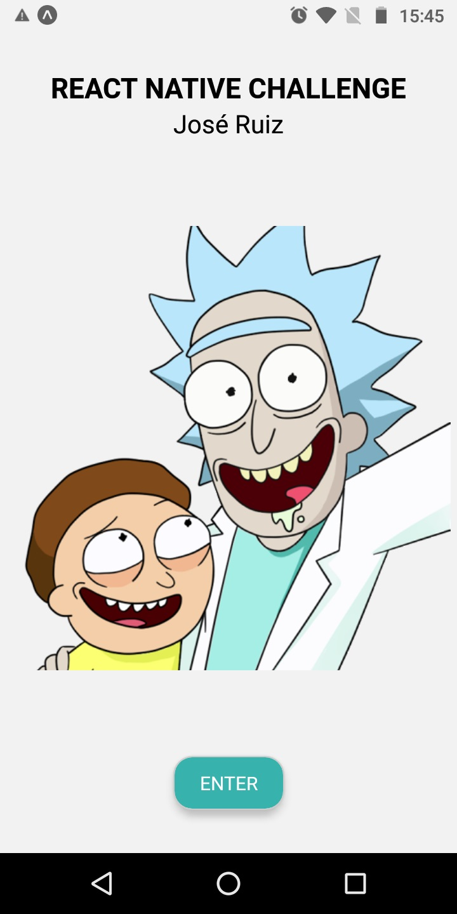
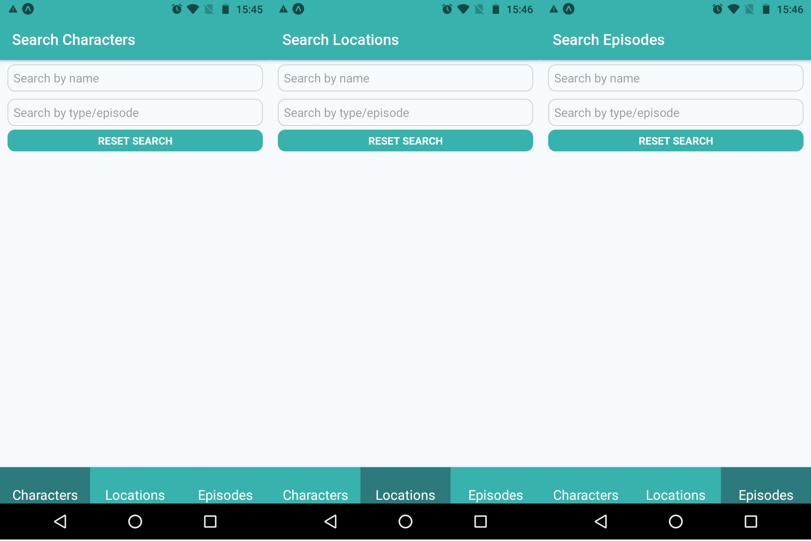
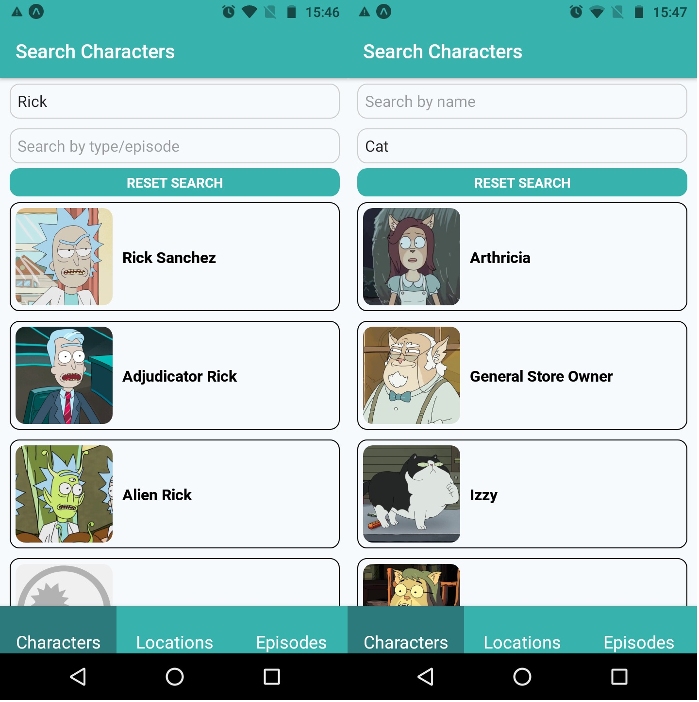
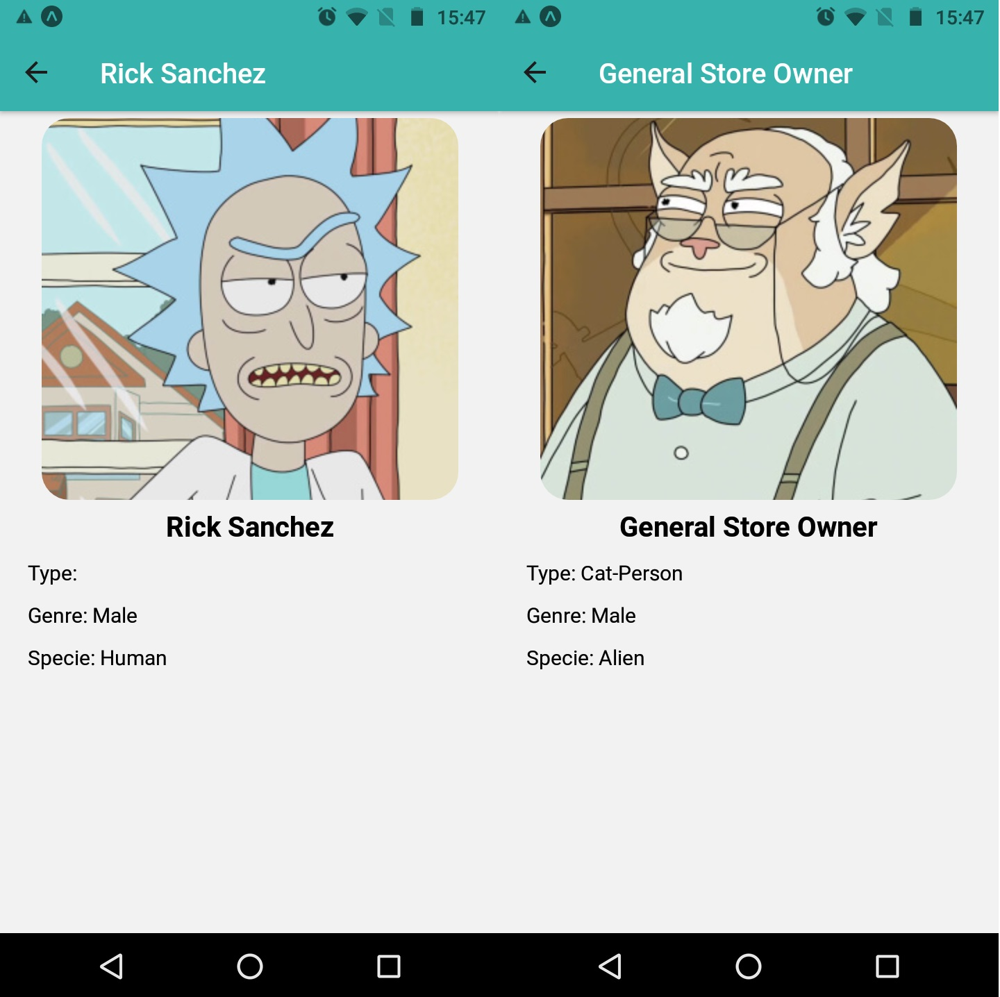
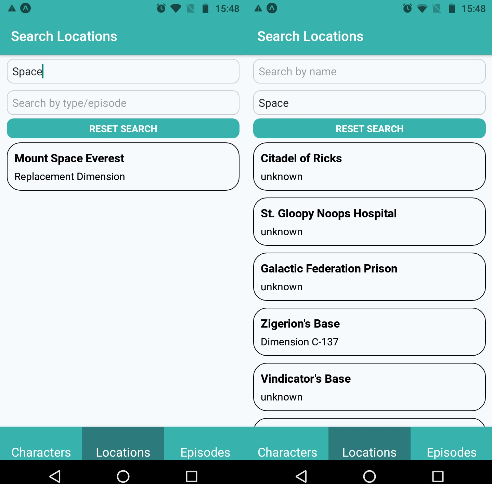
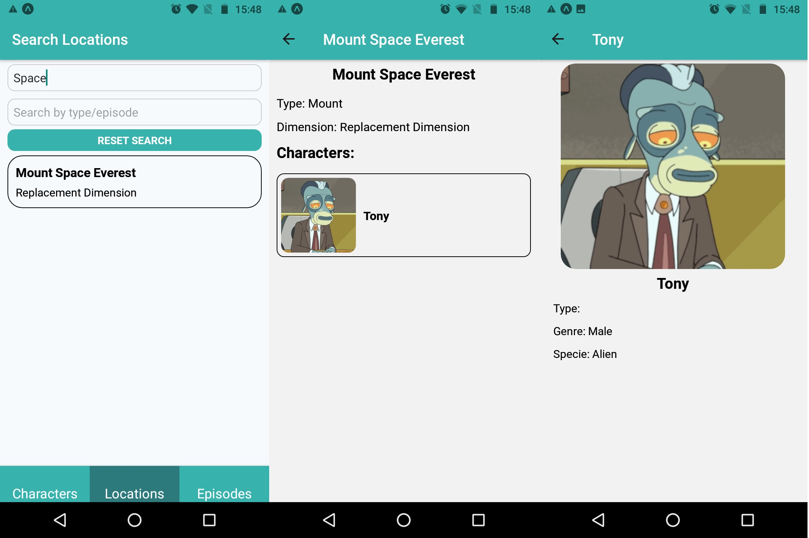
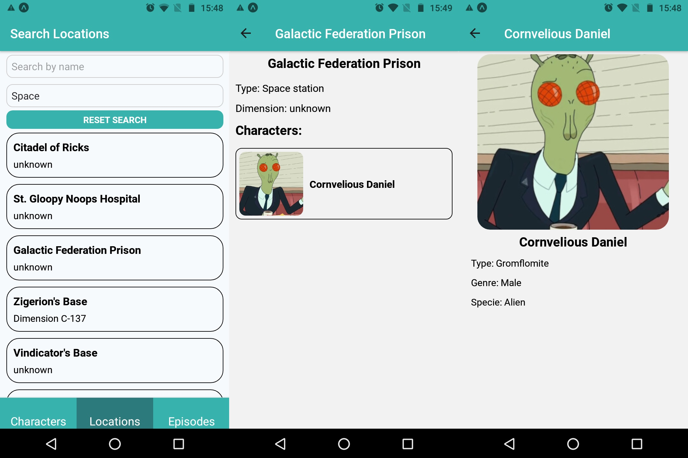
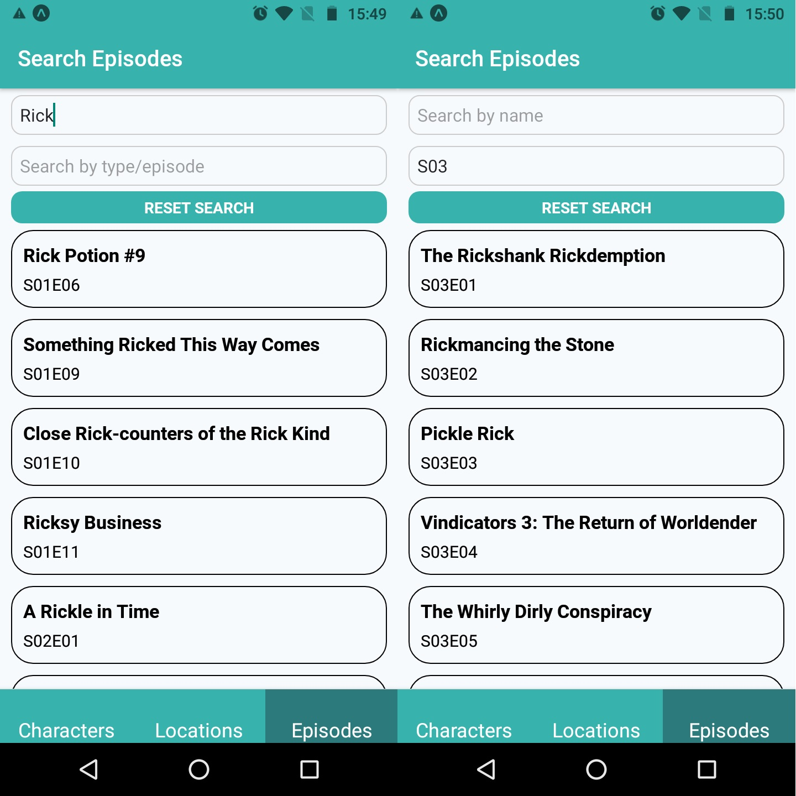
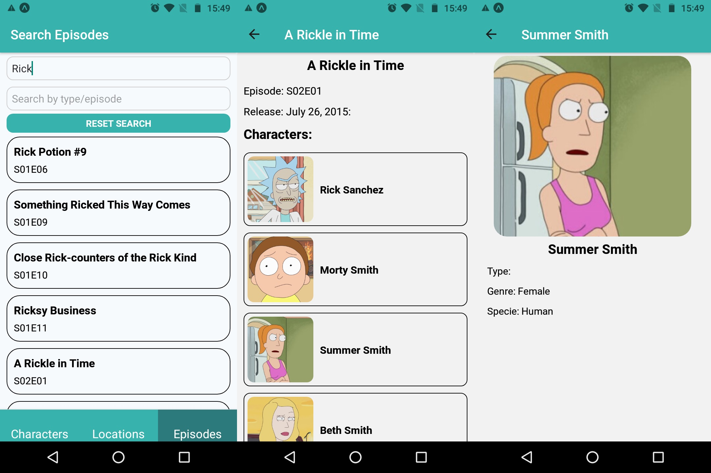
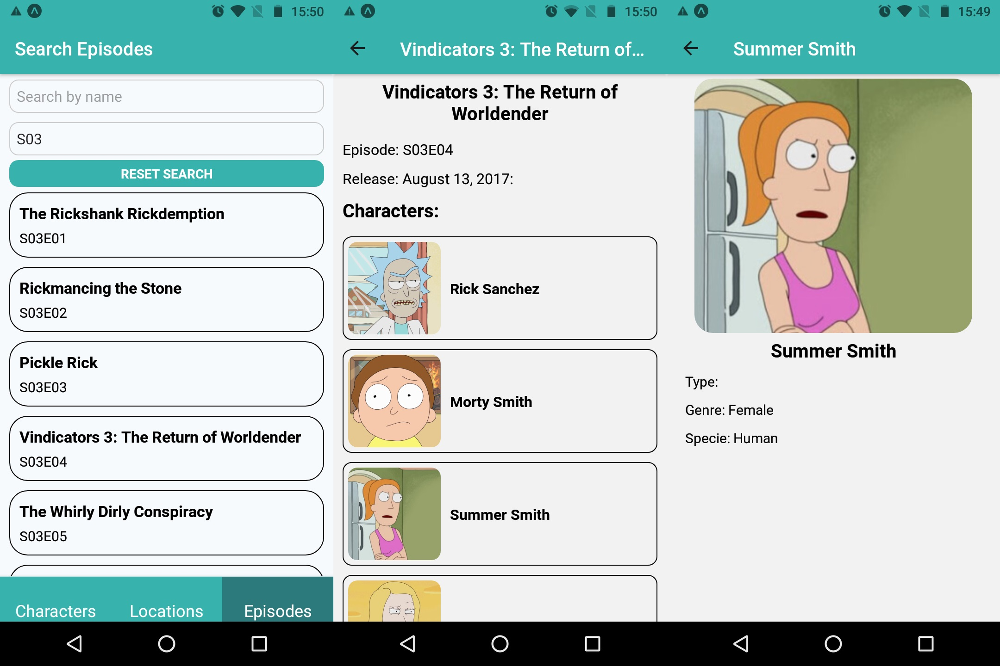

## About this app

This is a mobile application from the Rick and Morty series. In which you can search for Characters, Locations, even Episodes.

This application was made with Expo-cli and React Native.

This application was tested on a device Motorola G6 play with Android 8.0.

## Available Scripts

### `npm start`

Runs the app with the expo-cli

### `npm run android`

Runs the app for Android devide.

### `npm run web`

Runs the app for web.

## Learn more

You can search this application by Characters, Locations or Episodes, selecting one from the bottom tab navigation.

To search by Characters, you must first choose the Characters on the bottom tab and after typing three or more characters starting to search by name or type or even both.

With the list of results you can tap on any one to open a screen to show you more details about this character.

To search by Location, you must first choose the Locations on the bottom tab and after typing three or more characters starting to search by name or type or even both.

With the results list, you can tap on any to open a screen that shows you more details about this location and your first five characters at this location, you can also tap on any character to open a screen and show more details about that character.

To search by Episodes, you must first choose the Episodes on the bottom tab and after typing three or more characters starting to search by name or type or even both.

With the results list, you can tap on any to open a screen that shows you more details about this episode and your first five characters at this location, you can also tap on any character to open a screen and show more details about that character.

To reset the search you can tap on button reset search and this clear all results.

